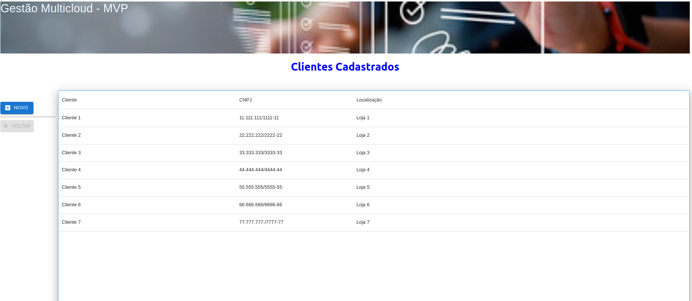
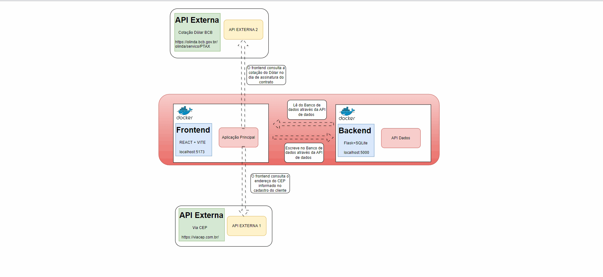

# Frontend Controle de Contratos - MVP




Este projeto integra o MVP da disciplina **Desenvolvimento Backend Avançado** e seu objetivo principal foi desenvolver um frontend que rode conteinerizado (docker) e ofereça funcionalidades para o cadastro simplificado de clientes em um banco de dados SQLite.

O desenvolvimento segue as especificações do protótipo figma disponibilizado neste [link](https://www.figma.com/design/SlqUMW8DEKEKWyWY5MigVb/Prototipa%C3%A7%C3%A3o-MVP-Desenv-Front-end--Avan%C3%A7ado?node-id=10-440).

Com o intuito de exercitar todos os conceitos vistos em aula foram utilizadas neste projeto as seguintes tecnologias:

- React (https://react.dev/)
- Vite (https://pt.vitejs.dev/)
- Mui (https://mui.com/)
- Docker(https://www.docker.com/)


# Atenção

Como o projeto ainda está em uma fase inicial rodará em uma versão simplificada do nginx.

---
## Pré-requisitos

- Instalar os seguintes pacotes: **git**, **nodejs** e o **docker**.

- Clonar os repositórios [d-cloud-broker-api](https://github.com/albbassi/d-cloud-broker-api.git) e [d-cloud-broker-front-react-vite](https://github.com/albbassi/d-cloud-broker-front-react-vite.git).


## Arquitetura ##

### Estrutura da Aplicação ###
A aplicação principal é responsável pela interface do usuário, permitindo que os usuários interajam com o sistema. Ela foi desenvolvida com React, Vite e MIU. A comunicação com as APIs é feita através de requisições HTTP, utilizando métodos como GET, POST, PUT e DELETE.

### Componentes ###

Aplicação Principal (Front-end) : Responsável pela interface do usuário.Faz chamadas às APIs para obter e enviar dados e à API interna para persistência dos dados.

APIs Externas: 
- API Externa 1: VIA CEP retorna um endereço completo a partir de um CEP. 
- API Externa 2: Olinda do Banco Central retorna a cotação diária do dólar oficial

Ambas as APIs externas podem ser acessadas via URLs específicas e retornam dados no formato JSON.

API Interna: Desenvolvida para gerenciar a persistência de dados. Utiliza as tecnologias OpenAPI, Flask e Sql Alchemy. Esta API interage diretamente com um banco de dados (sqlite3) para armazenar e recuperar informações relevantes para a aplicação.

Execução em Containers Docker

O Frontend e a API de dados são executados em containeres Docker, o que proporciona um ambiente isolado e consistente para cada parte da aplicação.


Como vantagens do Docker podemos citar: 
 
- Isolamento: A API e a aplicação front-end rodam em seu próprio container, evitando conflitos de dependências.
- Escalabilidade: É fácil escalar componentes individuais conforme a demanda, simplesmente aumentando o número de containers.
- Facilidade de Desenvolvimento: Com Docker, todos os desenvolvedores podem ter a mesma configuração de ambiente.
- Interação do Usuário: O usuário realiza uma ação na interface da aplicação front-end (cadastro de cliente).

Chamada às APIs:

A aplicação front-end envia uma requisição à API Externa 1 para consultar um CEP e para a Api Externa 2 para precificar o valor de um contrato em dólares. Quando o usuário cria ou atualiza informações, a aplicação front-end envia os dados para a API Interna, que se encarrega de persistir essas informações no banco de dados.

Respostas e Atualizações:

As APIs respondem às requisições com os dados apropriados, e a aplicação front-end atualiza a interface do usuário com as informações recebidas.

Considerações Finais
A interação entre a aplicação front-end e as APIs, tanto externas quanto internas, é fundamental para a experiência do usuário e para a funcionalidade do sistema. Com o uso de containers Docker, a aplicação ganha em portabilidade, escalabilidade e facilidade de manutenção, permitindo que a equipe se concentre no desenvolvimento de novas funcionalidades e na melhoria contínua do sistema.



---

## Como executar

- Inicialize a aplicação de backend que tem seu passo a passo descrito [aqui](https://github.com/albbassi/d-cloud-broker-api).

- Assim que o servidor de backend estiver ativo, navegue até a pasta onde a aplicação d-cloud-broker-front-react-vite foi clonada e execute o comando abaixo. Este comando fará o build do código gerarando a imagem necessária à execução do frontend:

``` docker build -t d-cloud-broker-react-vite . ```

- Após o término do build execute o comando:

``` docker run -p 80:80 d-cloud-broker-react-vite ```

- Para interagir com a aplicação, acesse a url:


``` http://localhost/ ```

**Divirta-se!**
